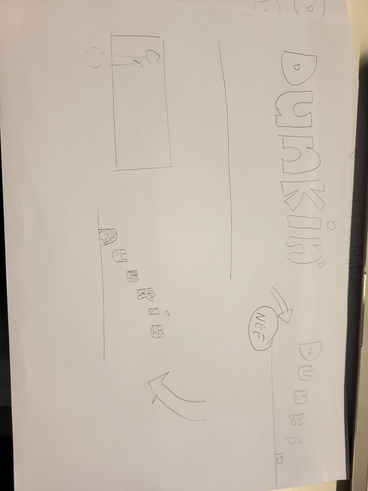
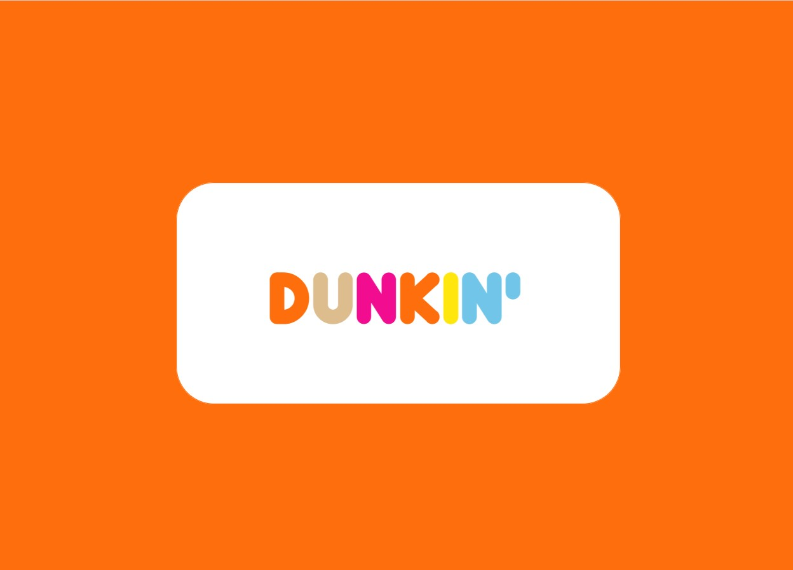
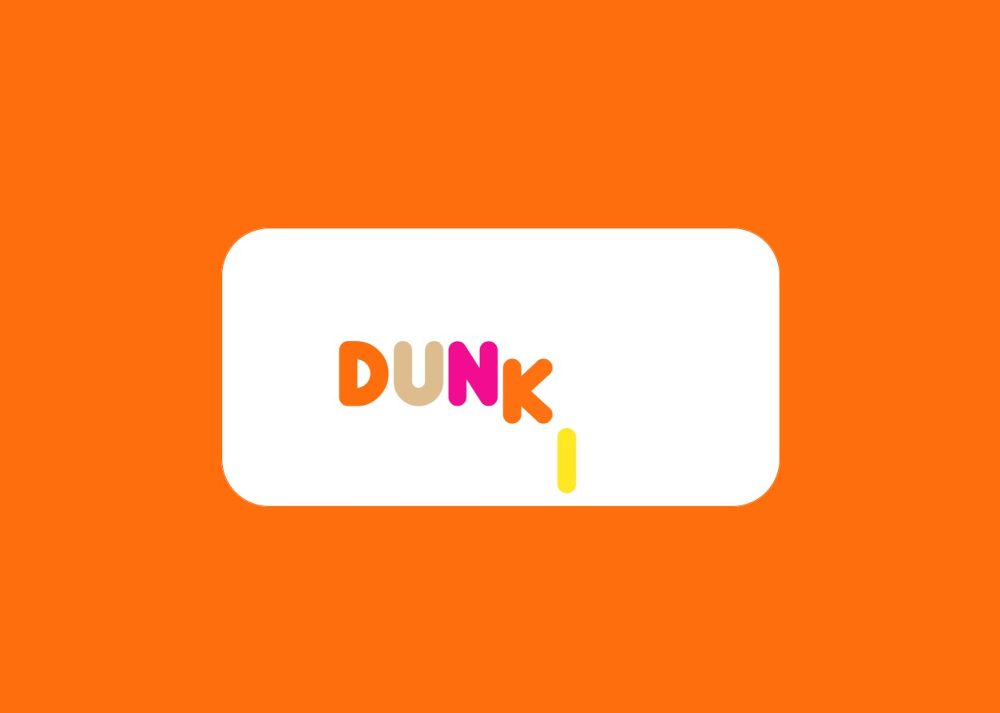
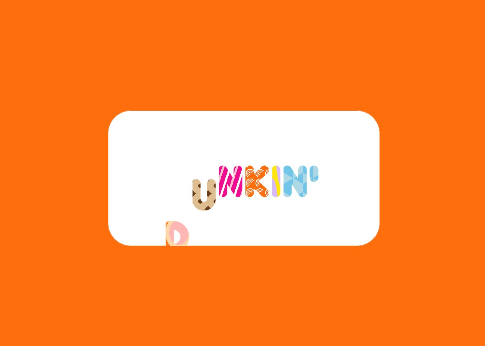
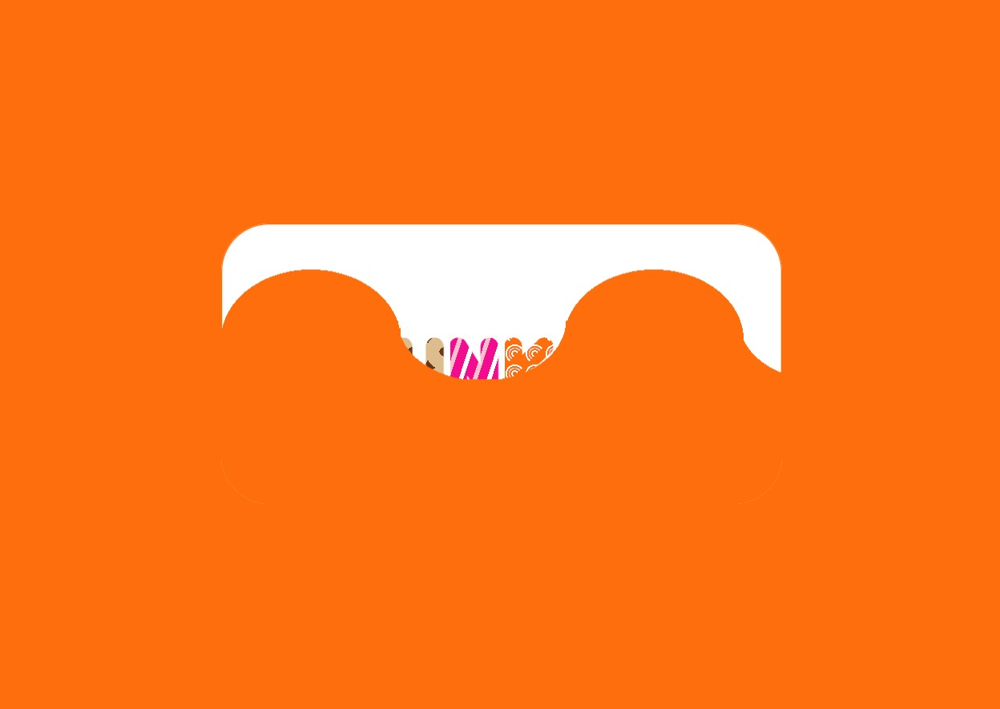
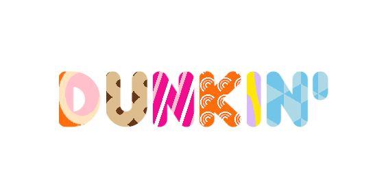
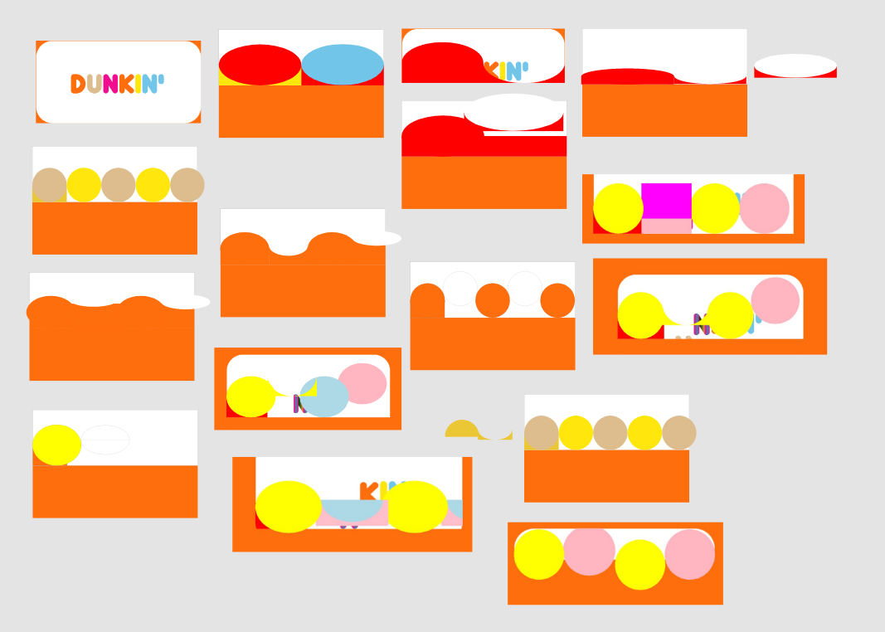

# Procesverslag
**Auteur:** -Aaminah Basnoe-

**De opdrachten:** [opdracht 1](opdracht1/index.html) en [opdracht 2](opdracht2/index.html)

Markdown is een simpele manier om HTML te schrijven.  
Markdown cheat cheet: [Hulp bij het schrijven van Markdown](https://github.com/adam-p/markdown-here/wiki/Markdown-Cheatsheet).

Nb. De standaardstructuur en de spartaanse opmaak van de README.md zijn helemaal prima. Het gaat om de inhoud van je procesverslag. Besteedt de tijd voor pracht en praal aan je website.

Nb. Door *open* toe te voegen aan een *details* element kun je deze standaard open zetten. Fijn om dat steeds voor de relevante stuk(ken) te doen.

## Bronnenlijst
  1. https://developer.mozilla.org/en-US/ 
  2. https://www.dafont.com/dunkin.font 
  3. https://superdesigner.co/tools/css-backgrounds
  4. https://www.youtube.com/watch?v=q7SbKbmTCzg&ab_channel=CodingArtist
  5. Sanne (docent)

## Opdracht 1 plan

  
uitwerken na schetsen idee (voor week 2)

  ### Je storyboard:
  

  ### Je ambitie: 
  Aan deze technieken/punten wil ik werken:
  - animeren (ik heb bijna geen ervaring met animatie's)
  - meer gradients gebruiken op verschillende manieren
  - werken met ::before en/of ::after
  - css kennis in het algemeen vergroten
 

## Opdracht 1 reflectie

  
uitwerken bij afronden opdracht (voor week 4)

  ### Je uitkomst - karakteristiek screenshot(s):
  
  
  
  

  ### Dit ging goed/Heb ik geleerd: 
  Korte omschrijving met plaatje(s)
  Ik ben over het algemeen best wel tevreden over mijn werk. Ik ben veel vooruit gekomen in vormgeven met CSS. Ik had nog niet echt gewerkt met CSS background patterns, dus dat vond ik wel leuk om te leren en om mee te oefenen. Ook het animatie-gedeelte ben ik tevreden mee. Ik had voor dit vak nog weinig ervaring met animeren in CSS, dus hier heb ik zeker veel over geleerd. Verder is het me gelukt een light/dark mode te maken.

  

  ### Dit was lastig/Is niet gelukt:
  Korte omschrijving met plaatje(s)
  Wat ik erg lastig vond, was het maken van de golf die omhoog gaat. Ik heb echt heel veel tijd besteed aan dingen proberen met gradients. Ook had ik veel op internet gezocht, maar die maakten zowat allemaal gebruik van svg's of een generator. Ik ben er wel tevreden mee want het ziet er niet verkeerd uit, maar uiteindelijk is het toch niet helemaal geworden wat ik wilde. 

  

## Opdracht 2 plan

  
uitwerken na schetsen idee (voor week 5)

  ### Je ontwerp:
  

  ### Je ambitie: 
  Aan deze technieken/punten wil ik werken:
  - punt 1
  - punt 2
  - nog een punt
  - ...

## Opdracht 2 test

  
uitwerken na testen (week 7)

  Neem minimaal 5 bevindingen op:

  ### Bevinding 1:
  Omschrijving van wat er nog niet orde was (tekst en afbeeding(en)).

  #### oplossing:
  Beschrijving hoe je het hebt hebt opgelost of als het niet gelukt is hoe je het zou oplossen (tekst en afbeeding(en)).

  ### Bevinding 2:
  Omschrijving van wat er nog niet orde was (tekst en afbeeding(en)).

  #### oplossing:
  Beschrijving hoe je het hebt hebt opgelost of als het niet gelukt is hoe je het zou oplossen (tekst en afbeeding(en)).

  ### Bevinding 3:
  ...

## Opdracht 2 reflectie

  
uitwerken bij afronden opdracht (voor week 8)

  ### Je uitkomst - karakteristiek screenshot(s):
  

  ### Dit ging goed/Heb ik geleerd: 
  Korte omschrijving met plaatje(s)

  

  ### Dit was lastig/Is niet gelukt:
  Korte omschrijving met plaatje(s)

  

