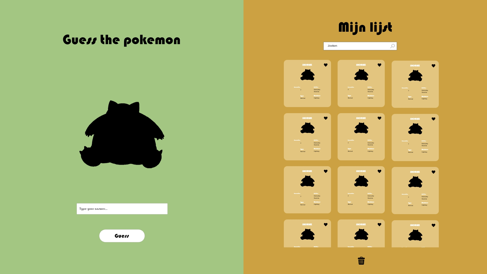

# Procesverslag
**Auteur:** -Aaminah Basnoe-

**De opdrachten:** [opdracht 1](opdracht1/index.html) en [opdracht 2](opdracht2/index.html)

Markdown is een simpele manier om HTML te schrijven.  
Markdown cheat cheet: [Hulp bij het schrijven van Markdown](https://github.com/adam-p/markdown-here/wiki/Markdown-Cheatsheet).

Nb. De standaardstructuur en de spartaanse opmaak van de README.md zijn helemaal prima. Het gaat om de inhoud van je procesverslag. Besteedt de tijd voor pracht en praal aan je website.

Nb. Door *open* toe te voegen aan een *details* element kun je deze standaard open zetten. Fijn om dat steeds voor de relevante stuk(ken) te doen.

## Bronnenlijst
  ### voor opdracht 1:
  1. https://developer.mozilla.org/en-US/ 
  2. https://www.dafont.com/dunkin.font 
  3. https://superdesigner.co/tools/css-backgrounds
  4. https://www.youtube.com/watch?v=q7SbKbmTCzg&ab_channel=CodingArtist
  5. Sanne (docent)
  
  ### voor opdracht 2:
  1. https://developer.mozilla.org/en-US/
  2. https://sortablejs.github.io/Sortable/
  3. https://codepen.io/shooft/pen/YzOrQxo
  4. https://codepen.io/shooft/pen/BaOwRzv
  5. https://codepen.io/shooft/pen/PoRyxbR
  6. https://developer.mozilla.org/en-US/docs/Web/JavaScript/Reference/Global_Objects/Array/splice
  7. https://codepen.io/shooft/pen/MWPMmyq
  8. https://codepen.io/shooft/pen/xxzjJeW
  9. https://listjs.com/docs/
  10. https://cdnjs.cloudflare.com/ajax/libs/list.js/2.3.1/list.min.js
  11. https://codepen.io/shooft/pen/WNKWjmx?editors=0100
  12. ChatGBT
  13. Sanne (docent)

## Opdracht 1 plan

  
uitwerken na schetsen idee (voor week 2)

  ### Je storyboard:
  

  ### Je ambitie: 
  Aan deze technieken/punten wil ik werken:
  - animeren (ik heb bijna geen ervaring met animatie's)
  - meer gradients gebruiken op verschillende manieren
  - werken met ::before en/of ::after
  - css kennis in het algemeen vergroten
 

## Opdracht 1 reflectie

  
uitwerken bij afronden opdracht (voor week 4)

  ### Je uitkomst - karakteristiek screenshot(s):
  
  
  
  

  ### Dit ging goed/Heb ik geleerd: 
  Korte omschrijving met plaatje(s)
  Ik ben over het algemeen best wel tevreden over mijn werk. Ik ben veel vooruit gekomen in vormgeven met CSS. Ik had nog niet echt gewerkt met CSS background patterns, dus dat vond ik wel leuk om te leren en om mee te oefenen. Ook het animatie-gedeelte ben ik tevreden mee. Ik had voor dit vak nog weinig ervaring met animeren in CSS, dus hier heb ik zeker veel over geleerd. Verder is het me gelukt een light/dark mode te maken.

  

  ### Dit was lastig/Is niet gelukt:
  Korte omschrijving met plaatje(s)
  Wat ik erg lastig vond, was het maken van de golf die omhoog gaat. Ik heb echt heel veel tijd besteed aan dingen proberen met gradients. Ook had ik veel op internet gezocht, maar die maakten zowat allemaal gebruik van svg's of een generator. Ik ben er wel tevreden mee want het ziet er niet verkeerd uit, maar uiteindelijk is het toch niet helemaal geworden wat ik wilde. 

  

## Opdracht 2 plan

  
uitwerken na schetsen idee (voor week 5)

  ### Je ontwerp:
  
  

  ### Je ambitie: 
  Aan deze technieken/punten wil ik werken:
  - Javascript skills verbeteren
  - API
  - Dingen toevoegen aan een lijstje
  - Met een randomizer een spelletje maken
  - zoekfunctie laten werken
  - Leren hoe libraries werken en toepassen

## Opdracht 2 test

  
uitwerken na testen (week 7)

  Neem minimaal 5 bevindingen op:

  ### Bevinding 1:
  Randomizer laten werken ook nadat je al een pokemon hebt geraden, niet alleen in het begin.

  #### oplossing:
  De math random en math floor code die ervoor zorgen dat je een rondom getal krijgt heb ik in een functie gezet, waardoor er niet maar 1 keer een random getal wordt gegenereerd als je die code niet in een functie zet. 

  ### Bevinding 2:
  Guess button disablen als de input leeg is.

  #### oplossing:
  Ik heb een functie aangemaakt die checkt of de inputvalue leeg is of niet. Eerst had ik het niet in een functie gezet, waardoor het maar 1 keer werd gechecked.

  ### Bevinding 3:
  Ervoor zorgen dat elke pokemon maar 1 keer voorkomt

  #### oplossing:
  als de pokemon is geraden wordt deze uit de array gegooid door middel van splice. Hierdoor komt de pokemon niet meer terug als hij al geraden is.

  ### Bevinding 4:
  Meerdere data in een array stoppen, waardoor je niet elke pokemon apart moet koppelen aan het plaatje.

  #### oplossing:
  ik heb een var aangemaakt met {} deze haken waar je meerdere data in kan stoppen dat bij elkaar hoort. Hiermee hoef je niet per pokemon de naam aan het plaatje te linken zoals ik dat eerst deed. 

  ### Bevinding 5:
  Met javascript de html van de list item toevoegen als je op de like button klikt.

  #### oplossing:
  Ik heb een nieuwe var aangemaakt waarin de html elementen van de lijst zitten. De if else functie checkt als je op de like button klikt of de pokemon al in de lijst zit, zo niet dan wordt de html toegevoegd, en anders wordt de list item eruit gehaald. 

## Opdracht 2 reflectie

  
uitwerken bij afronden opdracht (voor week 8)

  ### Je uitkomst - karakteristiek screenshot(s):
  
  
  
  

  ### Dit ging goed/Heb ik geleerd: 
  Het spelletje werkt. Daar ben ik blij mee. Je krijgt in het begin een random pokemon in het zwart en je moet raden welke het is. Raad je het verkeerd dan komt er "wrong" te staan en raad je het goed dan krijg je een punt en kan je de geraden pokemon toevoegen aan je lijst. Je kan hem ook weer verwijderen als je nog een keer op het hartje klikt. Je kan vervolgens op 'next pokemon' klikken en dan krijg je de volgende random pokemon te zien, terwijl de vorige eruit wordt gehaald (omdat je die dan al hebt geraden). Ik ben ook blij met de uitklapbare lijst (ik had hiervoor nog nooit een hamburgermenu gemaakt in css) en dat deze naast het spelletje komt te staan vanaf een bepaalde grootte. Verder heb ik geleerd hoe een API werkt en hoe je libraries kunt gebruiken (ookal was dit niet helemaal gelukt, zie volgende alinea).

  

  ### Dit was lastig/Is niet gelukt:
  Ik heb heel veel gestruggled met de zoekfunctie en die is uiteindelijk ook niet gelukt. Ik heb zelfs chatGBT gevraagd om mij te helpen, maar daar werd ik ook niet wijzer van. Ik denk dat het lag aan dat ik niet wilde zoeken in een al bestaande HTML lijst, maar in een die gemaakt was met javascript. Ik heb veel dingen geprobeerd, ook zonder de library, maar het werkte niet. Ik probeerde ook met de library een array aan te maken en daar in te zoeken, en dat deed de zoekfunctie het wel, alleen staat de lijst er dan altijd, i.p.v. alleen wanneer je ze hebt toegevoegd met de like button. Het lukte niet om deze 2 functies te combineren. Ook wilde ik dat je de kaartjes naar de vuilisbak kon slepen en dat de kaart dan verdwijnt, maar dat was ook niet gelukt. Ik probeerde het met de sortable library, maar het lukte niet om de kaart te laten verdwijnen. Het was wel gelukt om de kaarten in de lijst zelf te verplaatsen. 

  
  

